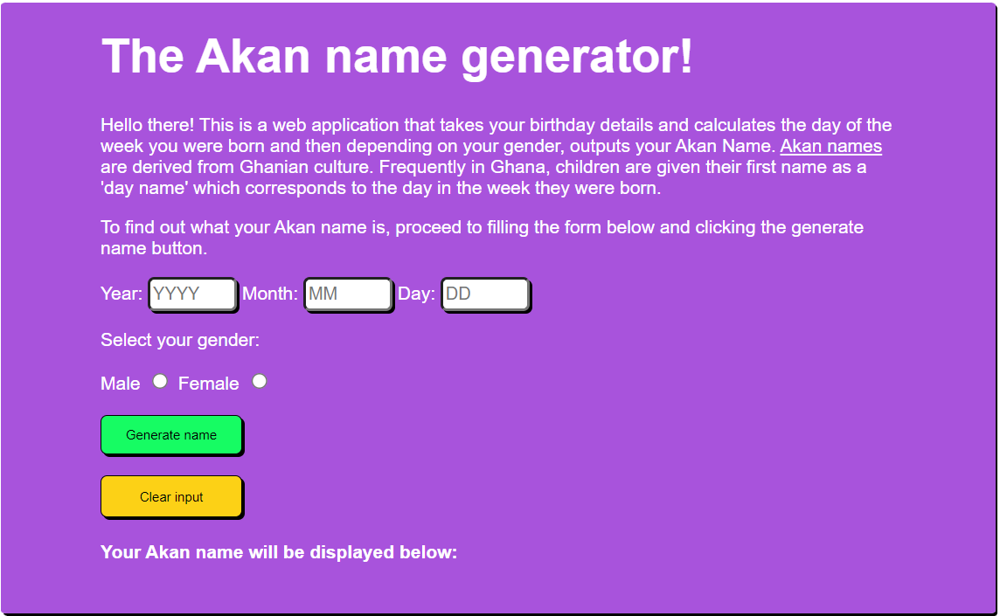

# Week2
 Akan Name.
 # Akan name generator
#### Simple web app that generates an Akan name based on the date of birth and gender by determining the day one was born, 20/10/2022

## Author
Hassan Bakhowe Toloi
## Versioning
Akan name generator
## Description
Akan names are derived from Ghanian culture. Frequently in Ghana, children are given their first name as a 'day name' which corresponds to the day in the week they were born. Here are Ghanian day names. This app takes a user's birthday on the form provided and calculates the day of the week they were born and then depending on their gender outputs their Akan Name.
This app will take in a user's year of birth, month of birth, day of birth and select gender. Using a formula assigned to a variable in the script.js file (dayOfWeekNumber), it will be possible to determine the exact day of the week the user was born and give them an Akan name based on their gender.
## Features
Here are the features in summary:
* Input year of birth.
* Input month of birth.
* Input day of birth.
* Select Gender.
* Output Akan name.
## Technologies Used
* HTML  
* CSS
* Javascript
## contact details
You can provide feedback or raise any issues/ bugs through the following means:
* toloih@gmail.com
## Github Pages link
The site is deployed at
